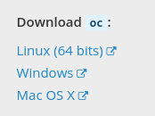

# Get an OpenShift Online Account

## Create Account

To create an OpenShift Online account, you will first need to have a Red Hat Developer account.
http://developers.redhat.com/register

Then go here to create your OpenShift Online account: https://www.openshift.com/container-platform/


1. Select Free Trial


2. Choose the free plan for developers


3. Sign in with your RH Developer Account


4. Verify your phone number by entering the PIN that is sent to you phone.


4. Confirm your subscription


5. Wait for email, then click on link to console in email

## Get OC Tools

To login to your OpenShift instance from your machine, you will need to install the OpenShift command line tool, ‘oc’.

You can do so by going to 'About' section in web console.


1. Go to the command line download page and select 'Command Line Tools' from the drop down when clicking the question mark. That page's link should be similar to https://{YOURCLUSTER}.openshift.com/console/command-line




2. Download the appropriate ‘oc’ tool for your operating system

3. Extract the executable file from the tar (on Linux and Mac), or from the zip (on Windows)

#### Mac and Linux
```bash
tar -xvzf oc.tar.gz
cp oc /usr/local/bin/
chmod +x /usr/local/bin/oc
```

#### Windows
Extract the zip file onto your local hard drive in the location of your choosing.
##### Add to PATH
1. Start the System Control Panel applet (Start - Settings - Control Panel - System). You may have to select View --> Small Icons
2. Select the Advanced tab.
3. Click the Environment Variables button.
4. Under System Variables, select Path, then click Edit.
5. You'll see a list of folders. For example, my system shows:
```
C:\Program Files\Windows Resource Kits\Tools\;%SystemRoot%\system32;%SystemRoot%;%SystemRoot%\System32\Wbem;C:\Program Files\Support Tools\;C:\Program Files\Common Files\Roxio Shared\DLLShared;C:\Program Files\Common Files\Ulead Systems\MPEG;C:\Program Files\Intel\DMIX;C:\Program Files\Executive Software\Diskeeper\;C:\Program Files\Bonjour\;C:\Program Files\QuickTime\QTSystem\;C:\Program Files\Misc
```
6. You can add additional folders that you want to include in your path. Simply put "<folder with 'oc' tool>;" to the beginning of the PATH and click OK
7. You'll need to restart the command prompt to use the updated system path.
